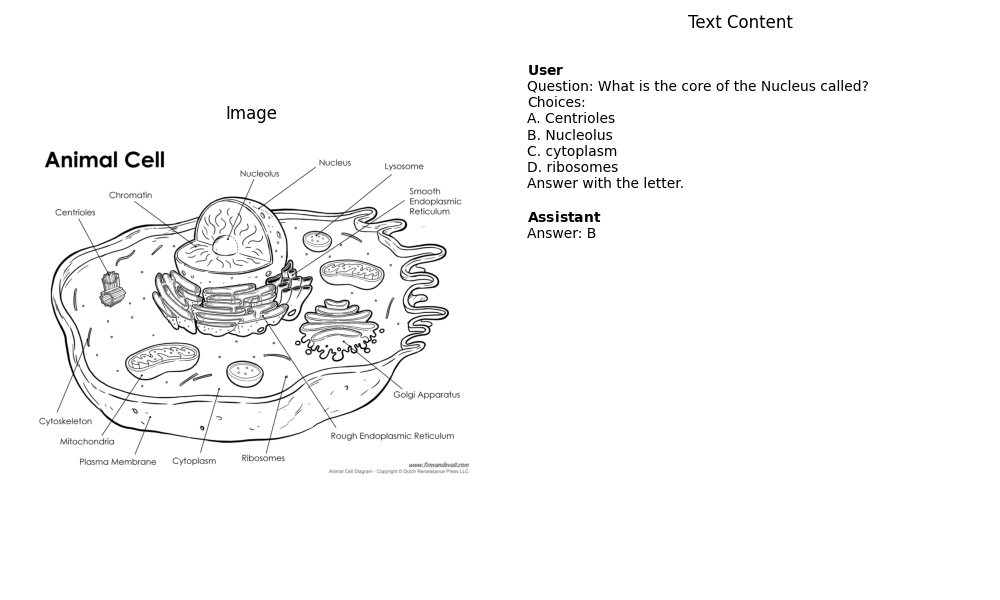

# MultiModal Data Pipeline

## Samlpe from the Hugging Face Dataset
`uv run 01_check_dataset.py`



## Pad the Dataset
`uv run 02_naive_pad_dataloader.py`

```
input_ids torch.Size([8, 762])
attention_masks torch.Size([8, 762])
images torch.Size([8, 3, 256, 256])
labels torch.Size([8, 762])
```

## Pad the Dataset to a constant length
`uv run 03_constraint_len_dataloader.py`

```
input_ids torch.Size([8, 1024])
attention_masks torch.Size([8, 1024])
images torch.Size([8, 3, 256, 256])
labels torch.Size([8, 1024])
```