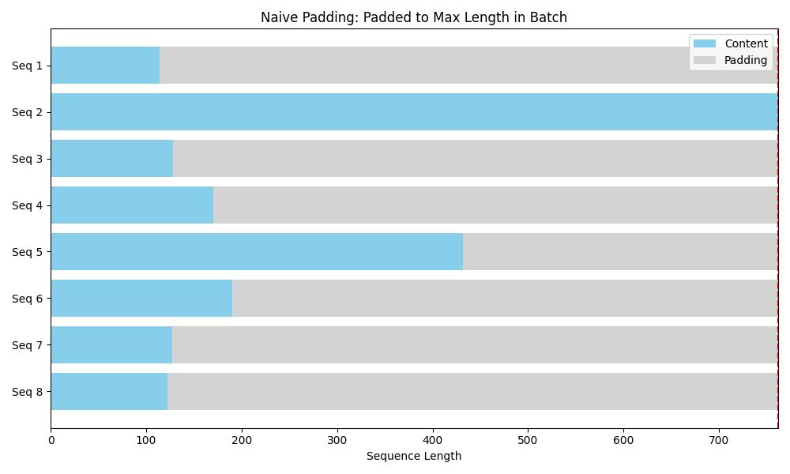

# MultiModal Data Pipeline

> [!NOTE]
> Official Blog Post: https://huggingface.co/blog/mmdp

## Stage 1: Checking the dataset

At this stage we check out the dataset (map styled) that we will work on.

RUN: `uv run 01_check_dataset.py`

```bash
Saved padding visualization to assets/01.png
```


## Stage 2: Naive padding

We wrap the map styled dataset into another map styled dataset. The reason for this is to process
each sample. The collator takes care of the naive padding, based on the maximum length of the sequence.

RUN: `uv run 02_naive_pad_dataloader.py`

```bash
input_ids torch.Size([8, 762])
attention_masks torch.Size([8, 762])
images 8
labels torch.Size([8, 762])
Saved padding visualization to assets/02.png
```



## Stage 3: Constrained Padding

Not much different than Stage 2, but here we provide the max length. If a sample is larger than
the max length, it if ignored.

RUN: `uv run 03_constraint_len_dataloader.py`

```bash
input_ids torch.Size([7, 512])
attention_masks torch.Size([7, 512])
images 7
labels torch.Size([7, 512])
Saved padding visualization to assets/03.png
```


## Stage 4: Naive Knapsack

Here we try to understand what knapsack is and how the consumer and producer paradigm works.

RUN: `uv run 04_naive_knapsack_dataloader.py`

```bash
=== Strategy: GREEDY ===

[tensor([1]), tensor([2]), tensor([3]), tensor([4]), tensor([5]), tensor([6]), tensor([7]), tensor([8]), tensor([9]), tensor([10]), tensor([11]), tensor([12]), tensor([13])]
[tensor([14]), tensor([15]), tensor([16]), tensor([17]), tensor([18]), tensor([19])]
[tensor([20]), tensor([21]), tensor([22]), tensor([23])]
[tensor([24])]

=== Strategy: BINPACK ===

[tensor([24]), tensor([23]), tensor([22]), tensor([21]), tensor([10])]
[tensor([20]), tensor([19]), tensor([18]), tensor([17]), tensor([16]), tensor([9]), tensor([1])]
[tensor([15]), tensor([14]), tensor([13]), tensor([12]), tensor([11]), tensor([8]), tensor([7]), tensor([6]), tensor([5]), tensor([4]), tensor([3]), tensor([2])]
```

## Stage 5: Knapsack

We apply what we learn in Stage 4 to the dataset at hand.

RUN: `uv run 05_knapsack_dataloader.py`

```bash
input_ids torch.Size([8, 512])
attention_masks torch.Size([8, 512])
images 8
labels torch.Size([8, 512])
Saved padding visualization to assets/05.png
```


